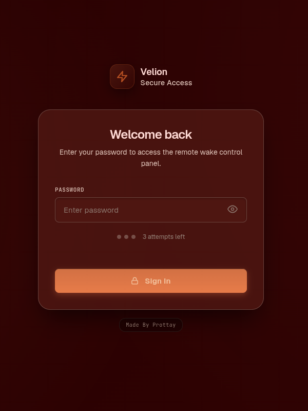
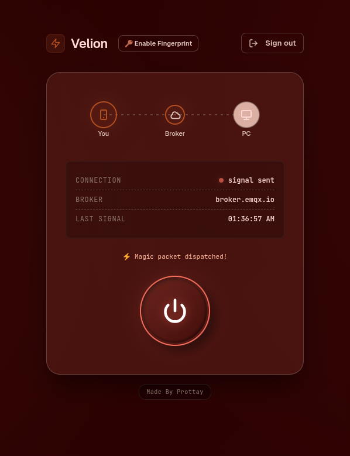
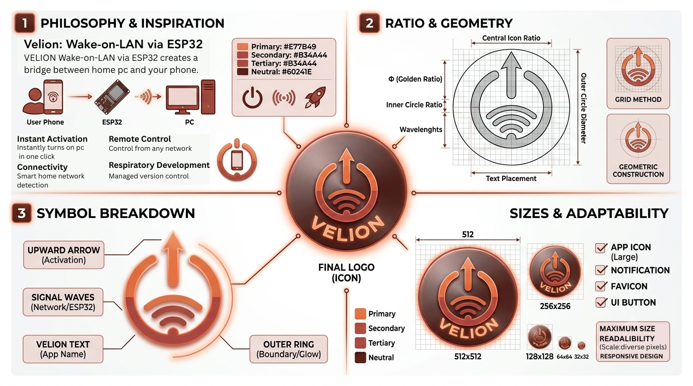

# Velion-WoL from Anywhere · Professional Remote Wake Ecosystem

  

  
  
  

  <b>Velion-WoL from Anywhere</b> is a high-performance, standalone Android ecosystem engineered to provide absolute control over PC power states. By merging <b>Local Network UDP broadcasting</b> with <b>Global MQTT signaling</b>, Velion offers a zero-compromise solution for waking computers securely from anywhere in the world.

  <a href="https://github.com/SilverCipherr/Velion/releases/download/v2.2.2/Velion-WoL.from.Anywhere.apk"><b>Download Latest APK</b></a>

---

## 🚀 Latest Releases

**V2.2.2**

* QoL update: Added setup guide on setting screen.

---

## ✨ New in Version 2.2+

### 📱 Multi-Device Command Center

Manage multiple targets (e.g., *Home Workstation*, *Office PC*, *Media Server*) from a single unified dashboard. Each device profile stores its own MAC address, MQTT topic, and network gateway.

### 🛠️ AI-Powered ESP32 Code Generator

Instantly generate production-ready C++ code for your ESP32 hardware directly from the app. It automatically injects your WiFi credentials, target MAC, and secure MQTT topics into a low-latency networking template.

### 📖 Interactive Onboarding

New step-by-step interactive guides for **Windows** and **Linux**. Learn exactly how to configure BIOS, Device Manager, and `ethtool` settings to ensure your hardware is ready for remote wake.

---

## 📸 System Interface

  
  

---

## 🛰️ The Identity

The name **Velion** is a fusion of movement, speed, and technical precision:

* **Vel** — Derived from *velocity* (speed), *velox* (Latin for swift), and *veil* (representing the subtle, hidden background processes).
* **Ion** — Representing science, energy, and the high-tech foundation of the ecosystem.

  

---

## ⚡ Hybrid Intelligence Architecture

Velion doesn't just send a signal; it intelligently chooses the most efficient path based on your environment.

### 🏠 Local-First Dispatch (Zero Latency)

When the system detects you are on your <b>Home SSID</b>, the application switches to **Direct Mode**. It bypasses all cloud brokers and broadcasts a Raw UDP Magic Packet directly to the target PC's MAC address. This ensures instant wake-up even if your hardware controller is offline.

### 🌐 Remote MQTT Relay (Global Reach)

When outside your local network, Velion utilizes a hardened MQTT bridge. The command is routed through an encrypted topic to your **ESP32 Controller**, which then fires the physical Magic Packet within your home network.

## 🔐 Core Pillars

### 🛡️ Hardened Security

* **Encrypted Identity**: Secure your app with a custom standalone password.
* **Biometric Perimeter**: Native **Android Biometric API** integration for instant, secure access via Fingerprint.
* **Zero-Cloud Storage**: All device configurations are stored locally and securely on your device using the modern `com.velion.wol` package structure.

### 📡 Hybrid Connectivity

* **Gateway Awareness**: Automatic detection of your home network gateway IP ensures you always use the fastest path.
* **Resilient Fallback**: Seamless transition between local UDP and global MQTT signaling.

### 🎨 Elite UX Design

* **Obsidian Heritage Theme**: A custom dark aesthetic built for high-contrast legibility.
* **Signal Path Viz**: Real-time animations visualize the data packet's journey from your phone to the target PC.

---

## 🛠️ Technical Stack

| Layer | Component | Implementation |
| :--- | :--- | :--- |
| **Android** |  | Jetpack Compose, Coroutines, Material 3, HiveMQ |
| **Hardware** |  | ESP32, PubSubClient, UDP Multicast |
| **Storage** |  | SharedPrefs (JSON-based multi-profile) |
| **Logic** |  | Raw UDP Magic Packets + MQTT SSL/TLS |

---

## 📄 Licensing & Rights

Copyright (c) 2026 Prottay. All rights reserved. This project is proprietary software.

---

  <i>Velion-WoL from Anywhere — Effortless Control. Absolute Security.</i>

